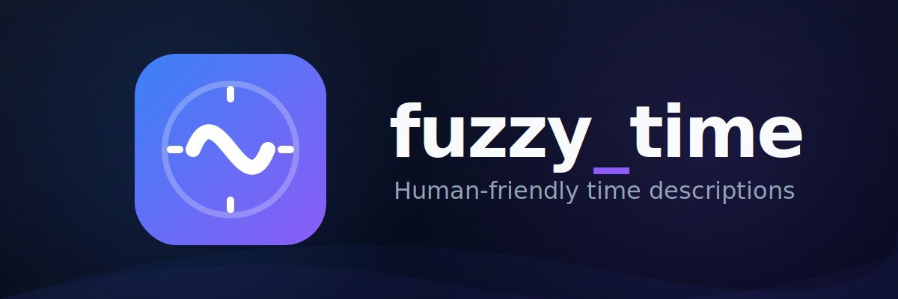

<p align="center">
  
</p>

A simple, dependency-free Flutter/Dart package that converts `DateTime` and `Duration` objects into human-friendly, "fuzzy" conversational strings like "about 5 minutes ago" or "in less than 2 hours".

## Features
- **Relative DateTime Formatting**: Generate relative timestamps (e.g. "5 minutes ago", "in a few seconds") using the static `FuzzyTime.from(dateTime)` API.
- **Duration Extensions**: Quick access to conversational strings via `.fuzzy` and `.fuzzyShort` getters on any `Duration`.
- **Short & Long Forms**: Switch between conversational styles (e.g., "about 5 minutes ago") and compact styles (e.g., "~5 min ago").
- **Built-in Localization**: Support for English, Spanish, French, Portuguese, German, and Italian.
- **Dependency Free**: Lightweight, pure Dart implementation with zero third-party dependencies.

## Getting started

Add `fuzzy_time` to your `pubspec.yaml`:

```yaml
dependencies:
  fuzzy_time: 
```

Import it in your Dart code:

```dart
import 'package:fuzzy_time/fuzzy_time.dart';
```

## Usage

### Relative Time (`DateTime`)

Use the static `FuzzyTime` API to convert a `DateTime` relative to `DateTime.now()`. It automatically identifies whether the time is in the past or future and applies the appropriate tense ("ago" or "in").

```dart
final past = DateTime.now().subtract(const Duration(minutes: 5));
final future = DateTime.now().add(const Duration(hours: 2));

// Quick usage (Long form)
print(FuzzyTime.from(past)); // "about 5 minutes ago"
print(FuzzyTime.from(future)); // "in about 2 hours"

// Short form
print(FuzzyTime.from(past, form: FuzzyForm.short)); // "~5 min ago"

// Explicit form
print(FuzzyTime.from(past, form: FuzzyForm.long)); // "about 5 minutes ago"
```

### Duration Length (`Duration`)

If you just need to know the length of a `Duration` without the past/future tense context, use the included **extension** on `Duration`.

The most convenient way is to use the `.fuzzy` and `.fuzzyShort` getters.

```dart
final duration = const Duration(minutes: 42);

// Long conversational form
print(duration.fuzzy); // "about 40 minutes"

// Short compact form
print(duration.fuzzyShort); // "~40 min"

// Functional form (with options)
print(duration.fuzzyTime(form: FuzzyForm.long)); // "about 40 minutes"
print(duration.fuzzyTime(form: FuzzyForm.short)); // "~40 min"

// Defaults to long form
print(duration.fuzzyTime()); // "about 40 minutes"
```

## Localization

`fuzzy_time` supports a variety of languages via the `FuzzyLocale` enum. You can change the global locale used by the package at any time, for instance, during the initialization of your app or when the user changes their language setting.

```dart
// Simply pass the target locale from the predefined enum:
FuzzyTimeLocale.setLocale(FuzzyLocale.es);

final past = DateTime.now().subtract(const Duration(days: 3));
print(FuzzyTime.from(past)); 
// Output: "hace unos 3 días"
```

Currently supported locales:
- `FuzzyLocale.en` (English - Default)
- `FuzzyLocale.es` (Spanish)
- `FuzzyLocale.fr` (French)
- `FuzzyLocale.pt` (Portuguese)
- `FuzzyLocale.de` (German)
- `FuzzyLocale.it` (Italian)

*Note, locales were auto generated with Gemini 3.1 model.


## Additional information

Contributions to add more languages or address issues are welcome. Feel free to open an issue or pull request on the repository!
